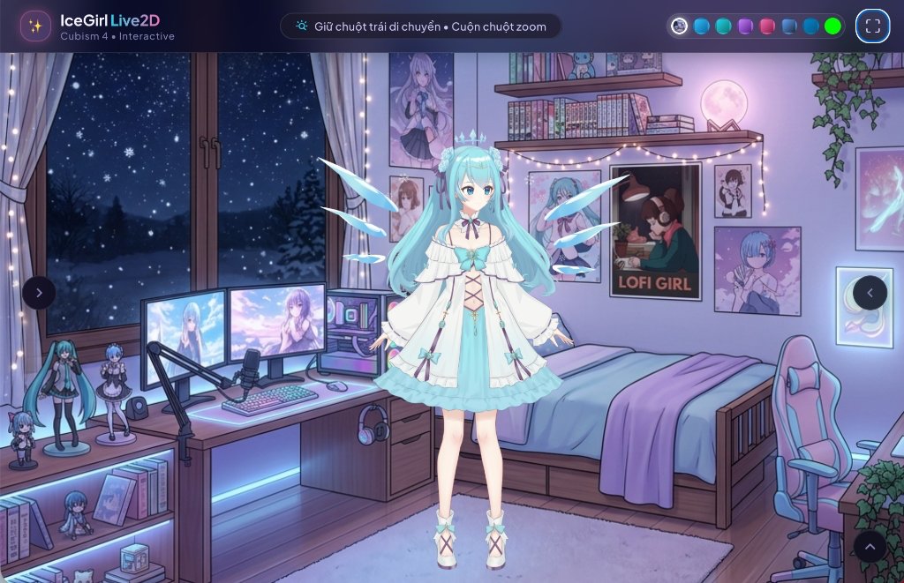

# 🌸 IceGirl Live2D Viewer — Ultra Premium AI Experience

Language / Ngôn ngữ: **[ 🇻🇳 Tiếng Việt ](README.md)** | **[ 🇬🇧 English ](README_EN.md)**

[](https://github.com)
[](https://www.live2d.com)
[](i18n.js)

Trình diễn mô hình **Live2D (Cubism 4)** tương tác cao cấp kết hợp trợ lý AI đa nền tảng (**Google Gemini**, **OpenRouter**, **Cohere**) hỗ trợ phản hồi cảm xúc và hệ thống **Đa ngôn ngữ i18n 9 Quốc gia**. 



## ✨ Tính Năng Nổi Bật

- 🌐 **Hệ Thống Đa Ngôn Ngữ i18n (9 Quốc gia):** Dịch toàn bộ giao diện & Khung chat AI cho **Tiếng Việt 🇻🇳, English 🇬🇧, 日本語 🇯🇵, 中文 🇨🇳, 한국어 🇰🇷, Français 🇫🇷, Español 🇪🇸, Deutsch 🇩🇪, Русский 🇷🇺**. Tự động nhận diện ngôn ngữ trình duyệt và lưu ưu tiên người dùng.
- 🎨 **100% Vibe Coding:** Toàn bộ dự án được thiết kế, tối ưu WebGL & xây dựng giao diện hoàn toàn bằng cảm hứng nghệ thuật và trợ lý AI Pair Programmer.
- 🎭 **Biểu cảm & Phụ kiện linh hoạt:** Hỗ trợ toggle độc lập phụ kiện (tai mèo, vương miện, cánh băng...) và biểu cảm khuôn mặt.
- ⚡ **Chuyển động (Motions):** Thư viện motion phong phú, tự động quay về trạng thái `Idle` mượt mà không bị tàn ảnh tay.
- 🤖 **Trợ lý AI Cảm Thụ Cảm Xúc:** Tự động nhận diện cảm xúc trong cuộc trò chuyện (vui, thích, ngạc nhiên...) để kích hoạt biểu cảm & dáng điệu nhân vật tương ứng.
- 🧠 **Hỗ trợ Multi-AI Provider:** Tùy chọn sử dụng Google Gemini, OpenRouter (Llama 3.3, DeepSeek, Claude, GPT-4o-mini) hoặc Cohere với System Prompt thích ứng theo ngôn ngữ đã chọn.
- 🎥 **Chroma Green Mode:** Hỗ trợ phông xanh chuẩn cho OBS Studio để livestreamer/VTuber dễ dàng tách nền.
- 🔒 **Bảo mật tối đa:** 100% Client-Side, API Key được lưu trực tiếp trên trình duyệt cá nhân, không thông qua server trung gian.

## 🚀 Hướng Dẫn Sử Dụng

1. Clone repository về máy:
   ```bash
   git clone https://github.com/duydeptrai999/AI-girl-friends-Ice-girls.git
   ```
2. Mở file `index.html` trực tiếp trên trình duyệt hoặc chạy qua Local Server (VS Code Live Server, Python `http.server`, v.v.).
3. Bấm vào biểu tượng 💬 Trò chuyện AI -> ⚙️ Cài đặt để nhập API Key và bắt đầu trải nghiệm!

## 🛡️ Lưu Ý Bảo Mật (Security & Privacy)

- **API Key Storage:** Khóa API của bạn được lưu bảo mật trong `localStorage` cá nhân của trình duyệt. 
- **No Proxy Server:** Ứng dụng kết nối trực tiếp đến Endpoint của nhà cung cấp AI (Google / OpenRouter / Cohere).
- **XSS Protection:** Tất cả phản hồi từ AI đều được làm sạch (sanitize) trước khi xuất Markdown.

## ⚖️ Bản Quyền Mô Hình (Model License Notice)

> ⚠️ **Lưu ý:** Quyền sử dụng thương mại mô hình Live2D thuộc tác giả **TianyeLulu** ([Booth Shop](https://tianyelulu.booth.pm)). File mô hình đính kèm trong repository này chỉ phục vụ mục đích minh họa giao diện demo. Vui lòng không tái phân phối thương mại file mô hình gốc khi chưa có sự đồng ý của tác giả.

---
✨ *Built with 100% Vibe Coding energy, 💙 & Live2D Cubism 4.*
